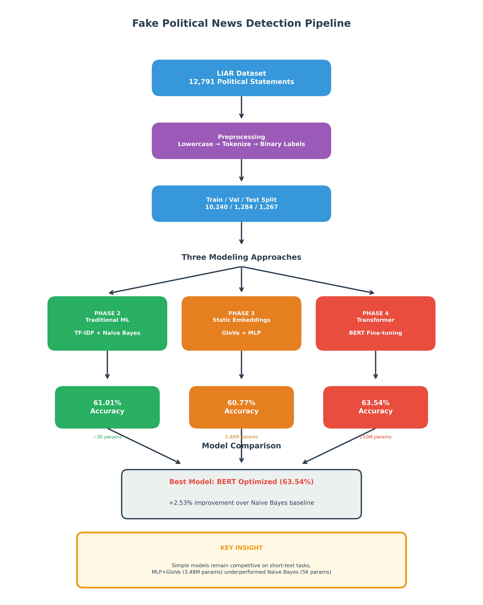

# Fake Political News Detection Using NLP

[](https://www.python.org/downloads/)
[](https://tensorflow.org/)
[](https://huggingface.co/)
[](LICENSE)

**A Comparative Study of Traditional ML, Embeddings, and Transformer-based Approaches**

IE 7500 Applied NLP for Engineers | Northeastern University | Fall 2025

**Author:** Cosmos Ameyaw Kwakye

---

## 📌 Project Overview

This project implements and evaluates a comprehensive NLP pipeline for detecting fake political news using the LIAR benchmark dataset. We systematically compare three approaches—traditional machine learning, static word embeddings, and BERT transformers—to understand when model complexity provides value versus when simpler methods remain competitive.

### Why This Matters

Political misinformation undermines democratic processes and public trust. With the rapid spread of false claims on social media, automated fact-checking systems are increasingly critical. This project provides insights into which NLP techniques are most effective for detecting misinformation in short-form political content.

---

## 🎯 Key Results

| Model | Test Accuracy | F1-Score | Parameters |
|-------|---------------|----------|------------|
| Naive Bayes (Baseline) | 61.01% | 0.6916 | ~5K |
| MLP + GloVe | 60.77% | 0.6343 | 3.48M |
| BERT (Initial) | 63.06% | 0.6247 | 110M |
| **BERT (Optimized)** | **63.54%** | **0.6283** | **110M** |

### 🏆 Best Model: BERT Optimized — 63.54% accuracy (+2.53% over baseline)

---

## 💡 Key Findings

1. **Simple models remain competitive** — Naive Bayes (5K params) outperformed MLP+GloVe (3.48M params) by 0.24%, demonstrating that model complexity doesn't guarantee better performance on small, short-text datasets.

2. **BERT provides meaningful improvement** — Despite the dataset constraints (10K samples, 18-word average), BERT's pre-training on 3.3B words enables effective transfer learning.

3. **Text-only approach isolates language modeling** — Our 63.54% represents 99.2% of the estimated text-only BERT ceiling (63-65%). Published benchmarks of 68-72% incorporate metadata, custom architectures, and ensemble methods.

4. **Hyperparameter optimization matters** — Reducing `max_length` from 128 to 64 tokens improved accuracy by 0.48%, aligning sequence length with actual text statistics.

---

## 📊 Pipeline Overview



```
LIAR Dataset (12,791 statements)
         ↓
    Preprocessing
    (Lowercase → Tokenize → Binary Labels)
         ↓
    Train/Val/Test Split
    (10,240 / 1,284 / 1,267)
         ↓
    ┌────────────────┼────────────────┐
    ↓                ↓                ↓
 PHASE 2         PHASE 3          PHASE 4
Traditional ML   Embeddings      Transformer
 TF-IDF +        GloVe +         BERT
 Naive Bayes     MLP             Fine-tuning
    ↓                ↓                ↓
 61.01%          60.77%           63.54%
```

---

## 📁 Project Structure

```
fake-political-news-detection-nlp/
├── notebooks/
│   ├── Phase2_Baseline_TFIDF.ipynb      # Traditional ML baseline
│   ├── Phase3_Embeddings_MLP.ipynb      # GloVe + Neural Network
│   └── Phase4_BERT_Finetuning.ipynb     # BERT transformer
├── reports/
│   ├── IE7500_Project_Final_Report.pdf  # Final report (9 pages + appendix)
│   └── figures/                         # All charts and visualizations
├── data/                                # Dataset folder (not included)
│   ├── train.tsv
│   ├── valid.tsv
│   └── test.tsv
├── README.md                            # This file
├── requirements.txt                     # Python dependencies
└── pipeline_flowchart.png               # Pipeline visualization
```

---

## 🔧 Installation & Setup

### Prerequisites
- Python 3.8+
- Google Colab (recommended) OR local Jupyter with GPU
- 8GB RAM minimum (16GB recommended for BERT)

### Quick Start

1. **Clone the repository**
   ```bash
   git clone https://github.com/KwakyeCA/fake-political-news-detection-nlp.git
   cd fake-political-news-detection-nlp
   ```

2. **Install dependencies**
   ```bash
   pip install -r requirements.txt
   ```

3. **Download NLTK data**
   ```python
   import nltk
   nltk.download('punkt')
   nltk.download('stopwords')
   nltk.download('wordnet')
   ```

4. **Download LIAR dataset**
   - Source: [Kaggle - LIAR Dataset](https://www.kaggle.com/datasets/mmaestri/liar-dataset)
   - Place `train.tsv`, `valid.tsv`, `test.tsv` in the `data/` folder

5. **Download GloVe embeddings** (for Phase 3)
   - Download: [GloVe 6B](https://nlp.stanford.edu/projects/glove/)
   - Extract `glove.6B.300d.txt`

### Running the Notebooks

**Option 1: Google Colab (Recommended)**
- Upload notebooks to Colab
- Upload dataset files when prompted
- Run all cells: `Runtime → Run all`

**Option 2: Local Jupyter**
```bash
jupyter notebook
# Open notebooks in order: Phase2 → Phase3 → Phase4
```

---

## 📈 Detailed Results

### Performance Comparison

| Approach | Published Range | Our Result | Achievement |
|----------|-----------------|------------|-------------|
| Traditional ML | 58-62% | 61.01% | 98.4% of max |
| Static Embeddings | 59-63% | 60.77% | 96.5% of max |
| BERT (text-only) | 63-65%* | 63.54% | 99.2% of max |
| BERT (with enhancements) | 68-72% | N/A | — |

*Estimated range for text-only BERT based on published ablation studies

### Understanding the Gap to Published Benchmarks

Our 63.54% vs published 68-72% reflects **methodological scope**, not implementation deficiency:

| Enhancement | Estimated Gain |
|-------------|----------------|
| Metadata Integration (speaker, party, history) | +2-5% |
| Custom Architectures (BERT + BiLSTM) | +1-3% |
| Extensive Hyperparameter Search | +0.5-2% |
| Data Augmentation | +1-3% |
| Ensemble Methods | +1-2% |

---

## 🛠️ Methodology

### Phase 1: Data Preprocessing
- Text cleaning (lowercase, URL/email removal)
- NLTK tokenization and lemmatization
- 6-class → Binary label mapping (Fake vs. Real)
- Result: 44% Fake / 56% Real (reasonably balanced)

### Phase 2: Traditional ML Baseline
- **TF-IDF Vectorization:** 5,000 features, unigrams + bigrams
- **Models:** Logistic Regression, Multinomial Naive Bayes
- **Selected:** Naive Bayes (highest F1-score: 0.6916)

### Phase 3: Neural Network with Static Embeddings
- **Embeddings:** GloVe 6B.300d (400K vocabulary, 85.2% coverage)
- **Architecture:** Embedding → GlobalAvgPool → Dense(256→128→64) → Sigmoid
- **Training:** Adam optimizer, early stopping (37 epochs)
- **Finding:** Underperformed baseline due to overfitting on small dataset

### Phase 4: BERT Fine-tuning
- **Model:** `bert-base-uncased` (110M parameters)
- **Training:** 4 epochs, lr=2e-5, batch_size=16
- **Optimization:** Reduced `max_length` from 128 → 64 tokens (+0.48%)
- **Result:** 63.54% accuracy — best performing model

---

## 📊 Visualizations

The project includes publication-quality visualizations:

- 📈 Model performance comparison charts
- 🎯 Confusion matrices for all models
- 📉 ROC curves and AUC scores
- 📊 Training/validation curves
- 🔍 Generalization analysis (train vs. val vs. test)
- 📋 Benchmark gap analysis

---

## 🔬 Reproducibility

- **Random seeds** set for all experiments
- **Model checkpoints** saved for each phase
- **Detailed hyperparameters** documented in notebooks
- **Hardware:** Google Colab Pro, NVIDIA Tesla T4 GPU (16GB)
- **Training time:** ~3 hours total across all phases

---

## 📚 References

1. Wang, W. Y. (2017). "Liar, liar pants on fire": A new benchmark dataset for fake news detection. *ACL 2017*.

2. Devlin, J., et al. (2018). BERT: Pre-training of deep bidirectional transformers for language understanding. *arXiv:1810.04805*.

3. Kaliyar, R. K., et al. (2021). FakeBERT: Fake news detection in social media with a BERT-based deep learning approach. *Multimedia Tools and Applications*.

4. Pennington, J., et al. (2014). GloVe: Global vectors for word representation. *EMNLP 2014*.

5. Mikolov, T., et al. (2013). Distributed representations of words and phrases and their compositionality. *NeurIPS 2013*.

6. Shu, K., et al. (2017). Fake news detection on social media: A data mining perspective. *ACM SIGKDD Explorations*.

7. Pérez-Rosas, V., et al. (2018). Automatic detection of fake news. *COLING 2018*.

8. Oshikawa, R., et al. (2020). A survey on natural language processing for fake news detection. *LREC 2020*.

---

## 🚀 Future Work

1. **Metadata Integration** — Incorporate speaker identity, party affiliation, and historical fact-check counts (+2-5% expected)

2. **Custom Architectures** — Implement BERT + BiLSTM or custom attention pooling

3. **Ensemble Methods** — Combine BERT-base, RoBERTa, and ALBERT

4. **Real-time Deployment** — Develop FastAPI endpoint for live fact-checking

---

## 👤 Author

**Cosmos Ameyaw Kwakye, MIMA**  
Graduate Student Ambassador - Data Analytics Engineering Program  
College of Engineering  
Northeastern University, Vancouver, Canada  
📧 kwakye.c@northeastern.edu

---

## 📄 License

This project is for educational purposes as part of IE 7500 coursework at Northeastern University.

---

**Last Updated:** December 2025  
**Status:** ✅ Project Complete
