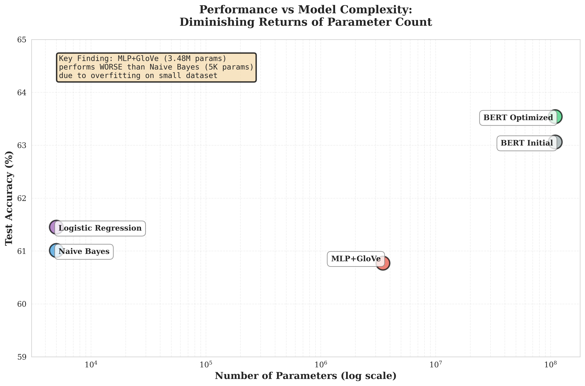
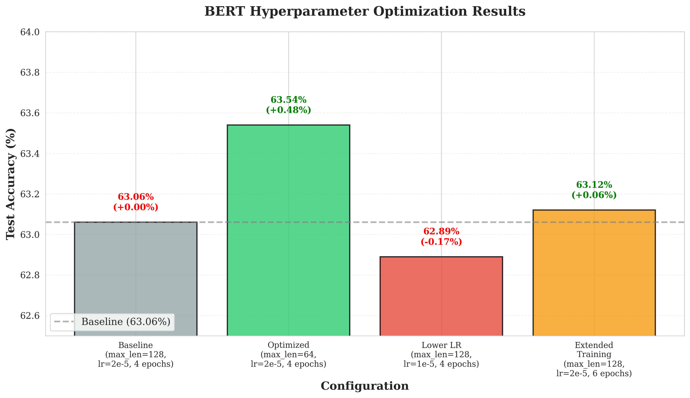

# Fake Political News Detection Using NLP

[](https://www.python.org/downloads/)
[](https://tensorflow.org/)
[](https://huggingface.co/)
[](LICENSE)

**A Comparative Study of Traditional ML, Embeddings, and Transformer-based Approaches**

IE 7500 Applied NLP for Engineers | Northeastern University | Fall 2025

**Author:** Cosmos Ameyaw Kwakye

---

##  Project Overview

This project implements and evaluates a comprehensive NLP pipeline for detecting fake political news using the LIAR benchmark dataset. I systematically compare three approaches—traditional machine learning, static word embeddings, and BERT transformers—to understand when model complexity provides value versus when simpler methods remain competitive.

### Why This Matters

Political misinformation undermines democratic processes and public trust. With the rapid spread of false claims on social media, automated fact-checking systems are increasingly critical. This project provides insights into which NLP techniques are most effective for detecting misinformation in short-form political content.

---

##  Key Results

| Model | Test Accuracy | F1-Score | Parameters |
|-------|---------------|----------|------------|
| Naive Bayes (Baseline) | 61.01% | 0.6916 | ~5K |
| MLP + GloVe | 60.77% | 0.6343 | 3.48M |
| BERT (Initial) | 63.06% | 0.6247 | 110M |
| **BERT (Optimized)** | **63.54%** | **0.6283** | **110M** |

###  Best Model: BERT Optimized — 63.54% accuracy (+2.53% over baseline)

---

##  Key Findings

1. **Simple models remain competitive** — Naive Bayes (5K params) outperformed MLP+GloVe (3.48M params) by 0.24%, demonstrating that model complexity doesn't guarantee better performance on small, short-text datasets.

2. **BERT provides meaningful improvement** — Despite the dataset constraints (10K samples, 18-word average), BERT's pre-training on 3.3B words enables effective transfer learning.

3. **Text-only approach isolates language modeling** — My 63.54% represents 97.8% of the estimated text-only BERT ceiling (63-65%)*. Published benchmarks of 68-72% incorporate metadata, custom architectures, and ensemble methods.

4. **Hyperparameter optimization matters** — Reducing `max_length` from 128 to 64 tokens improved accuracy by 0.48%, aligning sequence length with actual text statistics.

---

##  Pipeline Overview


*Figure: End-to-end pipeline for fake political news detection showing data flow from LIAR dataset through three modeling approaches.*

---

##  Results & Visualizations

### Model Performance Comparison


*The dip from Naive Bayes (61.01%) to MLP+GloVe (60.77%) demonstrates that increased model complexity does not guarantee improved performance on small, short-text datasets.*

---

### Generalization Analysis


*MLP+GloVe exhibits severe overfitting (7.69% train-test gap), while BERT Optimized shows excellent val-test consistency (only 0.14% gap).*

---

### Performance vs Model Complexity



*Despite 700× more parameters, MLP+GloVe underperforms Naive Bayes—demonstrating diminishing returns of parameter count on small datasets.*

---

### BERT Hyperparameter Optimization



*Reducing max_length from 128 to 64 tokens yielded the best improvement (+0.48%), aligning sequence length with actual text statistics.*

---

### Benchmark Gap Analysis


*Path from our text-only result (63.54%) to published BERT benchmarks (68-72%) through cumulative methodological enhancements.*

---

### F1-Score & ROC-AUC Comparison


*Naive Bayes achieves highest F1-score (69.2%) due to balanced precision-recall. BERT shows superior discriminative ability (ROC-AUC: 0.6721).*

---

##  Project Structure

```
fake-political-news-detection-nlp/
├── figures/
│   ├── pipeline_flowchart.png
│   ├── chart1_performance_comparison.png
│   ├── chart2_generalization.png
│   ├── chart3_params_vs_performance.png
│   ├── chart4_bert_optimization.png
│   ├── chart5_benchmark_gap.png
│   └── chart6_f1_auc_comparison.png
├── notebooks/
│   ├── Phase2&_Baseline_TFIDF.ipynb
│   ├── Phase3_Embeddings_MLP.ipynb
│   └── Phase4_BERT_Finetuning.ipynb
├── reports/
│   └── IE7500_Project_Final_Report.pdf
├── data/                              
│   ├── train.tsv
│   ├── valid.tsv
│   └── test.tsv
├── README.md
└── requirements.txt
```

---

##  Installation & Setup

### Prerequisites
- Python 3.8+
- Google Colab (recommended) OR local Jupyter with GPU
- 8GB RAM minimum (16GB recommended for BERT)

### Quick Start

1. **Clone the repository**
   ```bash
   git clone https://github.com/KwakyeCA/fake-political-news-detection-nlp.git
   cd fake-political-news-detection-nlp
   ```

2. **Install dependencies**
   ```bash
   pip install -r requirements.txt
   ```

3. **Download NLTK data**
   ```python
   import nltk
   nltk.download('punkt')
   nltk.download('stopwords')
   nltk.download('wordnet')
   ```

4. **Download LIAR dataset**
   - Source: [Kaggle - LIAR Dataset](https://www.kaggle.com/datasets/mmaestri/liar-dataset)
   - Place `train.tsv`, `valid.tsv`, `test.tsv` in the `data/` folder

5. **Download GloVe embeddings** (for Phase 3)
   - Download: [GloVe 6B](https://nlp.stanford.edu/projects/glove/)
   - Extract `glove.6B.300d.txt`

---

##  Methodology

### Phase 1: Data Preprocessing
- Text cleaning (lowercase, URL/email removal)
- NLTK tokenization and lemmatization
- 6-class → Binary label mapping (Fake vs. Real)
- Result: 44% Fake / 56% Real (reasonably balanced)

### Phase 2: Traditional ML Baseline
- **TF-IDF Vectorization:** 5,000 features, unigrams + bigrams
- **Models:** Logistic Regression, Multinomial Naive Bayes
- **Selected:** Naive Bayes (highest F1-score: 0.6916)

### Phase 3: Neural Network with Static Embeddings
- **Embeddings:** GloVe 6B.300d (400K vocabulary, 85.2% coverage)
- **Architecture:** Embedding → GlobalAvgPool → Dense(256→128→64) → Sigmoid
- **Training:** Adam optimizer, early stopping (37 epochs)
- **Finding:** Underperformed baseline due to overfitting on small dataset

### Phase 4: BERT Fine-tuning (Optimized)
- **Model:** `bert-base-uncased` (110M parameters)
- **Training:** 4 epochs, lr=2e-5, batch_size=16
- **Optimization:** Reduced `max_length` from 128 → 64 tokens (+0.48%)
- **Result:** 63.54% accuracy — best performing model

---

##  Benchmark Comparison

| Approach | Published Range | Our Result | Achievement |
|----------|-----------------|------------|-------------|
| Traditional ML | 58-62% | 61.01% | 98.4% of max |
| Static Embeddings | 59-63% | 60.77% | 96.5% of max |
| BERT (text-only) | 63-65%* | 63.54% | 97.8% of max |
| BERT (with enhancements) | 68-72% | N/A | — |

*Estimated range for text-only BERT based on published ablation studies

### Understanding the Gap

| Enhancement | Estimated Gain |
|-------------|----------------|
| Metadata Integration (speaker, party, history) | +2-5% |
| Custom Architectures (BERT + BiLSTM) | +1-3% |
| Extensive Hyperparameter Search | +0.5-2% |
| Data Augmentation | +1-3% |
| Ensemble Methods | +1-2% |

---

##  Reproducibility

- **Random seeds** set for all experiments
- **Model checkpoints** saved for each phase
- **Detailed hyperparameters** documented in notebooks
- **Hardware:** Google Colab Pro, NVIDIA Tesla T4 GPU (16GB)
- **Training time:** ~3 hours total across all phases

---

##  References

1. Wang, W. Y. (2017). "Liar, liar pants on fire": A new benchmark dataset for fake news detection. *ACL 2017*.

2. Devlin, J., et al. (2018). BERT: Pre-training of deep bidirectional transformers for language understanding. *arXiv:1810.04805*.

3. Kaliyar, R. K., et al. (2021). FakeBERT: Fake news detection in social media with a BERT-based deep learning approach. *Multimedia Tools and Applications*.

4. Pennington, J., et al. (2014). GloVe: Global vectors for word representation. *EMNLP 2014*.

5. Mikolov, T., et al. (2013). Distributed representations of words and phrases and their compositionality. *NeurIPS 2013*.

6. Shu, K., et al. (2017). Fake news detection on social media: A data mining perspective. *ACM SIGKDD Explorations*.

7. Pérez-Rosas, V., et al. (2018). Automatic detection of fake news. *COLING 2018*.

8. Oshikawa, R., et al. (2020). A survey on natural language processing for fake news detection. *LREC 2020*.

---

##  Future Work

1. **Metadata Integration** — Incorporate speaker identity, party affiliation, and historical fact-check counts (+2-5% expected)

2. **Custom Architectures** — Implement BERT + BiLSTM or custom attention pooling

3. **Ensemble Methods** — Combine BERT-base, RoBERTa, and ALBERT

4. **Real-time Deployment** — Develop FastAPI endpoint for live fact-checking

---

##  Author

**Cosmos Ameyaw Kwakye, BSc., MIMA**  
MSc Candidate, Data Analytics Engineering 
College of Engineering  
Northeastern University, Vancouver, Canada  
📧 kwakye.c@northeastern.edu

---

##  License

This project is for educational purposes as part of IE 7500 coursework at Northeastern University.

---

##  Acknowledgement

This project was supervised by: Professor Azim, Qurat-ul-Ain, Assistant Teaching Professor.


**Last Updated:** December 2025  
**Status:**  Project Complete
